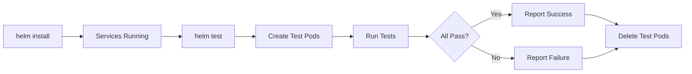

# Helm Chart Tests

This directory contains Helm test resources that validate the DocuTag deployment.

## Test Pods

The following test pods are included:

| Test | File | Description |
|------|------|-------------|
| **Controller Health** | `test-controller-health.yaml` | Verifies controller health endpoint returns 200 |
| **Web UI** | `test-web-ui.yaml` | Verifies web UI is accessible |
| **Database Connection** | `test-database-connection.yaml` | Tests PostgreSQL connectivity |
| **Redis Connection** | `test-redis-connection.yaml` | Tests Redis connectivity |
| **API Endpoints** | `test-api-endpoints.yaml` | Tests controller API endpoints (/health, /metrics, /api/sources) |

## Running Tests

### Run All Tests

After deploying the Helm chart:

```bash
helm test docutag -n docutag
```

### Run Specific Test

```bash
# Run only the controller health test
kubectl create -f chart/templates/tests/test-controller-health.yaml -n docutag

# View test logs
kubectl logs docutag-test-controller -n docutag

# Clean up
kubectl delete pod docutag-test-controller -n docutag
```

### Watch Test Execution

```bash
helm test docutag -n docutag --logs
```

## Test Output

Successful test output:

```
Pod docutag-test-controller pending
Pod docutag-test-controller running
Pod docutag-test-controller succeeded
Pod docutag-test-web pending
Pod docutag-test-web running
Pod docutag-test-web succeeded
Pod docutag-test-database pending
Pod docutag-test-database running
Pod docutag-test-database succeeded
Pod docutag-test-redis pending
Pod docutag-test-redis running
Pod docutag-test-redis succeeded
Pod docutag-test-api pending
Pod docutag-test-api running
Pod docutag-test-api succeeded

NAME: docutag
LAST DEPLOYED: ...
NAMESPACE: docutag
STATUS: deployed
REVISION: 1
TEST SUITE:     docutag-test-controller
Last Started:   ...
Last Completed: ...
Phase:          Succeeded
TEST SUITE:     docutag-test-web
Last Started:   ...
Last Completed: ...
Phase:          Succeeded
```

## How Tests Work

Helm tests use the `helm.sh/hook: test` annotation to mark pods as test resources. These pods:

1. Are **not deployed** during normal `helm install/upgrade`
2. Are **only created** when you run `helm test`
3. Run to completion and report success/failure via exit code
4. Are **automatically deleted** before the next test run (via `hook-delete-policy`)

## Test Lifecycle



## Adding New Tests

To add a new test:

1. Create a new YAML file in this directory
2. Use the test pod template:

```yaml
apiVersion: v1
kind: Pod
metadata:
  name: {{ include "docutag.fullname" . }}-test-mytest
  labels:
    {{- include "docutag.labels" . | nindent 4 }}
    app.kubernetes.io/component: test
  annotations:
    "helm.sh/hook": test
    "helm.sh/hook-delete-policy": before-hook-creation,hook-succeeded
spec:
  restartPolicy: Never
  containers:
  - name: test
    image: appropriate/test-image
    command:
      - sh
      - -c
      - |
        # Your test logic here
        # Exit 0 for success, non-zero for failure
```

3. Test locally:

```bash
helm install docutag ./chart --dry-run --debug
helm test docutag --logs
```

## Troubleshooting

### Test Pod Stays in Pending

```bash
# Check pod events
kubectl describe pod docutag-test-controller -n docutag

# Common causes:
# - Image pull issues
# - Resource constraints
# - Node selector mismatch
```

### Test Fails

```bash
# View test logs
kubectl logs docutag-test-controller -n docutag

# Keep test pod for debugging (don't auto-delete)
# Remove hook-delete-policy annotation from test YAML
```

### Tests Pass Locally but Fail in CI

- Check if services have had enough time to start
- Increase sleep delays in test scripts
- Verify liveness/readiness probes are passing first

## Integration with CI/CD

Tests can be integrated into CI/CD pipelines:

```yaml
# Example GitHub Actions workflow
- name: Deploy to staging
  run: helm upgrade --install docutag ./chart -n docutag

- name: Wait for rollout
  run: kubectl rollout status deployment -n docutag

- name: Run Helm tests
  run: |
    helm test docutag -n docutag --logs
    if [ $? -ne 0 ]; then
      echo "Tests failed!"
      exit 1
    fi
```

## Best Practices

1. **Keep tests fast** - Tests should complete in seconds, not minutes
2. **Test critical paths** - Focus on health endpoints and connectivity
3. **Use appropriate images** - Small, focused images (curl, redis-cli, psql)
4. **Handle timing** - Add sleep delays for services to become ready
5. **Clean up** - Use `hook-delete-policy` to auto-cleanup test pods
6. **Meaningful output** - Echo clear success/failure messages

## Related Documentation

- [Helm Test Documentation](https://helm.sh/docs/chart_template_guide/tests/)
- [Kubernetes Pod Lifecycle](https://kubernetes.io/docs/concepts/workloads/pods/pod-lifecycle/)
- [DocuTag Chart README](../README.md)
