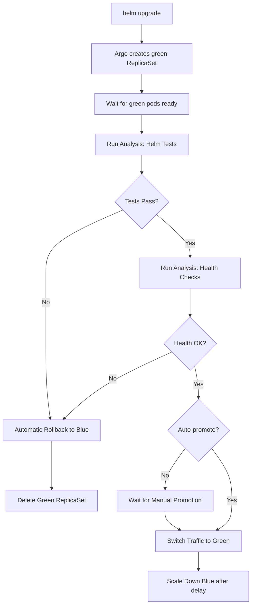

# Blue-Green Deployment Strategy for DocuTag

This document explores blue-green deployment options for DocuTag with automated rollback based on test results.

## Current State

**Deployment Method**: In-place Helm upgrades
- `helm upgrade` replaces pods in-place
- Rolling update strategy (one pod at a time)
- Manual rollback with `helm rollback` if issues detected

**Limitations**:
- No automated rollback on test failure
- Brief downtime during pod replacement
- Difficult to instant-rollback if issues appear

## Blue-Green Deployment Options

### Option 1: Argo Rollouts (Recommended)

**What it is**: Kubernetes controller that provides advanced deployment strategies (blue-green, canary) that work alongside Helm charts.

**Pros**:
- ✅ Native Kubernetes integration
- ✅ Works with existing Helm charts (minimal changes)
- ✅ Automated rollback on metric/test failure
- ✅ Traffic splitting and gradual rollout
- ✅ Battle-tested (used by GitLab, Intuit, etc.)
- ✅ Visual dashboard available

**Cons**:
- Requires installing Argo Rollouts controller
- Learning curve for Rollout CRDs

**How it works**:
1. Replace Deployment with Rollout resource
2. Define analysis templates (run tests, check metrics)
3. On upgrade, creates "green" ReplicaSet
4. Runs analysis (Helm tests, Prometheus metrics)
5. If analysis passes, switches traffic to green
6. If analysis fails, automatic rollback to blue

**Example Rollout**:
```yaml
apiVersion: argoproj.io/v1alpha1
kind: Rollout
metadata:
  name: docutag-controller
spec:
  replicas: 3
  strategy:
    blueGreen:
      activeService: docutag-controller
      previewService: docutag-controller-preview
      autoPromotionEnabled: false
      postPromotionAnalysis:
        templates:
        - templateName: helm-test-analysis
        - templateName: health-check-analysis
  template:
    # Same pod spec as current Deployment
```

### Option 2: Flagger (Progressive Delivery)

**What it is**: Progressive delivery operator that automates canary/blue-green deployments using service meshes or ingress controllers.

**Pros**:
- ✅ Works with Traefik (our ingress!)
- ✅ Automated rollback on metric threshold
- ✅ Gradual traffic shifting (canary style)
- ✅ Prometheus metrics integration

**Cons**:
- More complex than Argo Rollouts
- Requires Prometheus for metrics
- Less direct control over blue-green switch

**How it works**:
1. Flagger watches Deployment
2. On change, creates canary deployment
3. Gradually shifts traffic (10% → 25% → 50% → 100%)
4. Monitors metrics at each step
5. Automatic rollback if metrics degrade

### Option 3: Manual Blue-Green with Traefik Weighted Routing

**What it is**: Use multiple Helm releases with Traefik's weighted routing to manually control traffic split.

**Pros**:
- ✅ No additional tools required
- ✅ Full control over traffic split
- ✅ Uses existing Traefik infrastructure
- ✅ Simple to understand

**Cons**:
- ❌ Manual process (not automated)
- ❌ More complex Helm management (2 releases)
- ❌ No built-in rollback automation
- ❌ Requires manual test execution and traffic switching

**How it works**:
1. Deploy "blue" release: `helm install docutag-blue`
2. Deploy "green" release: `helm install docutag-green`
3. Use Traefik WeightedRoundRobin:
   ```yaml
   apiVersion: traefik.containo.us/v1alpha1
   kind: IngressRoute
   spec:
     routes:
     - services:
       - name: docutag-blue-controller
         port: 8080
         weight: 100  # 100% to blue
       - name: docutag-green-controller
         port: 8080
         weight: 0    # 0% to green
   ```
4. Run tests against green
5. If tests pass, shift weights (blue: 0, green: 100)
6. If tests fail, delete green release

### Option 4: Helm Hooks for Testing + Rollback Script

**What it is**: Use Helm's test hooks combined with a wrapper script that rolls back on test failure.

**Pros**:
- ✅ Uses existing Helm test infrastructure
- ✅ No additional operators required
- ✅ Simple bash script solution

**Cons**:
- ❌ Not true blue-green (still in-place upgrade)
- ❌ Brief downtime during rollback
- ❌ Manual script orchestration

**Implementation**:
```bash
#!/bin/bash
# deploy-with-tests.sh

RELEASE_NAME="docutag"
CHART_PATH="./chart"

# Get current revision before upgrade
CURRENT_REVISION=$(helm history $RELEASE_NAME -n docutag | tail -2 | head -1 | awk '{print $1}')

# Perform upgrade
echo "Upgrading to new version..."
helm upgrade $RELEASE_NAME $CHART_PATH -n docutag

# Wait for rollout
kubectl rollout status deployment -n docutag

# Run tests
echo "Running Helm tests..."
if helm test $RELEASE_NAME -n docutag --logs; then
  echo "✓ Tests passed! Deployment successful"
  exit 0
else
  echo "✗ Tests failed! Rolling back to revision $CURRENT_REVISION"
  helm rollback $RELEASE_NAME $CURRENT_REVISION -n docutag
  exit 1
fi
```

## Comparison Matrix

| Feature | Argo Rollouts | Flagger | Traefik Manual | Helm Script |
|---------|---------------|---------|----------------|-------------|
| **Automated Rollback** | ✅ Yes | ✅ Yes | ❌ Manual | ✅ Yes |
| **Zero Downtime** | ✅ Yes | ✅ Yes | ✅ Yes | ❌ No |
| **Test Integration** | ✅ Yes | ⚠️ Metrics only | ✅ Yes | ✅ Yes |
| **Complexity** | Medium | High | Medium | Low |
| **Additional Infra** | Argo Rollouts | Flagger + Prometheus | None | None |
| **Production Ready** | ✅ Yes | ✅ Yes | ⚠️ Manual | ⚠️ Basic |

## Recommended Approach: Argo Rollouts

**Why Argo Rollouts?**
1. Best balance of features vs complexity
2. Native Kubernetes integration
3. Works with existing Helm charts
4. Supports both blue-green AND canary
5. Built-in test/analysis framework
6. Wide adoption and community support

### Implementation Steps

#### 1. Install Argo Rollouts

```bash
# Install Argo Rollouts controller
kubectl create namespace argo-rollouts
kubectl apply -n argo-rollouts -f https://github.com/argoproj/argo-rollouts/releases/latest/download/install.yaml

# Install kubectl plugin (optional, for CLI control)
curl -LO https://github.com/argoproj/argo-rollouts/releases/latest/download/kubectl-argo-rollouts-linux-amd64
chmod +x kubectl-argo-rollouts-linux-amd64
sudo mv kubectl-argo-rollouts-linux-amd64 /usr/local/bin/kubectl-argo-rollouts
```

#### 2. Modify Helm Chart

Convert Deployments to Rollouts:

**Before** (current): `chart/templates/controller/deployment.yaml`
```yaml
apiVersion: apps/v1
kind: Deployment
metadata:
  name: {{ include "docutag.fullname" . }}-controller
spec:
  replicas: {{ .Values.controller.replicaCount }}
  # ...
```

**After** (with Argo Rollouts): `chart/templates/controller/rollout.yaml`
```yaml
{{- if .Values.blueGreen.enabled }}
apiVersion: argoproj.io/v1alpha1
kind: Rollout
{{- else }}
apiVersion: apps/v1
kind: Deployment
{{- end }}
metadata:
  name: {{ include "docutag.fullname" . }}-controller
spec:
  {{- if .Values.blueGreen.enabled }}
  strategy:
    blueGreen:
      activeService: {{ include "docutag.fullname" . }}-controller
      previewService: {{ include "docutag.fullname" . }}-controller-preview
      autoPromotionEnabled: {{ .Values.blueGreen.autoPromote }}
      scaleDownDelaySeconds: {{ .Values.blueGreen.scaleDownDelay }}
      postPromotionAnalysis:
        templates:
        - templateName: {{ include "docutag.fullname" . }}-helm-tests
        - templateName: {{ include "docutag.fullname" . }}-health-checks
  {{- else }}
  strategy:
    rollingUpdate:
      maxSurge: 1
      maxUnavailable: 0
  {{- end }}
  replicas: {{ .Values.controller.replicaCount }}
  template:
    # ... same pod spec as before
```

#### 3. Create Analysis Templates

**Helm Test Analysis**: `chart/templates/bluegreen/analysis-helm-tests.yaml`
```yaml
{{- if .Values.blueGreen.enabled }}
apiVersion: argoproj.io/v1alpha1
kind: AnalysisTemplate
metadata:
  name: {{ include "docutag.fullname" . }}-helm-tests
spec:
  metrics:
  - name: helm-test
    provider:
      job:
        spec:
          template:
            spec:
              containers:
              - name: helm-test
                image: alpine/helm:latest
                command:
                - sh
                - -c
                - |
                  helm test {{ .Release.Name }} -n {{ .Release.Namespace }} --logs
              restartPolicy: Never
          backoffLimit: 1
    successCondition: result == "Succeeded"
    failureLimit: 1
{{- end }}
```

**Health Check Analysis**: `chart/templates/bluegreen/analysis-health.yaml`
```yaml
{{- if .Values.blueGreen.enabled }}
apiVersion: argoproj.io/v1alpha1
kind: AnalysisTemplate
metadata:
  name: {{ include "docutag.fullname" . }}-health-checks
spec:
  metrics:
  - name: controller-health
    initialDelay: 10s
    interval: 10s
    successCondition: result == "200"
    failureLimit: 3
    provider:
      web:
        url: http://{{ include "docutag.fullname" . }}-controller:8080/health
        jsonPath: "{$.status}"

  - name: error-rate
    initialDelay: 30s
    interval: 30s
    successCondition: result < 0.05  # Less than 5% error rate
    failureLimit: 3
    provider:
      prometheus:
        address: http://prometheus:9090
        query: |
          sum(rate(http_requests_total{status=~"5.."}[5m]))
          /
          sum(rate(http_requests_total[5m]))
{{- end }}
```

#### 4. Add Blue-Green Values

**values.yaml**:
```yaml
# Blue-Green deployment configuration
blueGreen:
  enabled: false  # Enable for production
  autoPromote: false  # Manual promotion after analysis
  scaleDownDelay: 30  # Keep old version for 30s after switch
  analysis:
    helmTests: true
    healthChecks: true
    errorRateThreshold: 0.05  # 5% max error rate
```

**values-production.yaml**:
```yaml
blueGreen:
  enabled: true  # Enable blue-green for production
  autoPromote: false  # Require manual approval
  scaleDownDelay: 300  # Keep old version for 5min
```

#### 5. Deploy with Blue-Green

```bash
# Initial deployment
helm install docutag ./chart -n docutag

# Upgrade with blue-green (creates preview, runs tests)
helm upgrade docutag ./chart -n docutag

# Watch rollout progress
kubectl argo rollouts get rollout docutag-controller -n docutag --watch

# Promote if tests pass (or auto-promotes if autoPromote: true)
kubectl argo rollouts promote docutag-controller -n docutag

# Abort and rollback if issues found
kubectl argo rollouts abort docutag-controller -n docutag
```

#### 6. Visualization

Argo Rollouts provides a dashboard:

```bash
kubectl argo rollouts dashboard -n docutag
# Access at http://localhost:3100
```

Shows:
- Current active (blue) version
- Preview (green) version
- Analysis status
- Traffic split
- Promotion button

## Automated Rollback Flow



## Production Deployment Workflow

With Argo Rollouts enabled:

```bash
# 1. Create new release (triggers workflow)
git merge staging # Creates v1.1.0

# 2. Update Pulumi config with new version
cd infra
pulumi config set imageVersion 1.1.0 --stack production

# 3. Deploy (Argo handles blue-green automatically)
pulumi up --stack production

# 4. Monitor rollout
kubectl argo rollouts get rollout docutag-controller -n docutag --watch

# Output:
# Name:            docutag-controller
# Status:          Paused
# Strategy:        BlueGreen
# Images:          ghcr.io/docutag/docutag-controller:1.1.0 (green)
#                  ghcr.io/docutag/docutag-controller:1.0.0 (blue, active)
# Replicas:
#   Desired:       3
#   Current:       6 (3 blue, 3 green)
#   Updated:       3
#   Ready:         6
#   Available:     6
#
# Analysis Run:    Running (helm-tests: ✓, health-checks: running)

# 5. If analysis passes and autoPromote: false
kubectl argo rollouts promote docutag-controller -n docutag

# 6. Traffic switches to green, blue scaled down after delay
```

## Cost Considerations

**Additional Resources**:
- During deployment: 2x pods running (blue + green)
- Duration: ~5-10 minutes
- Cost impact: Minimal (only during upgrades)

**Recommendations**:
- Enable blue-green for **production only**
- Use rolling updates for dev/staging (cheaper)
- Set appropriate `scaleDownDelay` (don't keep both versions too long)

## Migration Path

**Phase 1: Non-Production** (Week 1)
1. Install Argo Rollouts in staging
2. Update Helm chart with conditional Rollout support
3. Test blue-green with `blueGreen.enabled: true` in staging
4. Validate automated rollback scenarios

**Phase 2: Production** (Week 2)
1. Enable Argo Rollouts in production Pulumi stack
2. Set `blueGreen.enabled: true` in production values
3. Perform test deployment during maintenance window
4. Monitor first production blue-green deployment

**Phase 3: Optimization** (Week 3+)
1. Add Prometheus metrics analysis
2. Tune analysis thresholds
3. Consider canary deployments for major changes
4. Implement auto-promotion for low-risk changes

## Alternative: Simple Helm Script (Quick Win)

If you want automated rollback **now** without Argo Rollouts:

Create `scripts/deploy-with-rollback.sh`:

```bash
#!/bin/bash
set -e

RELEASE_NAME="${1:-docutag}"
NAMESPACE="${2:-docutag}"
CHART_PATH="./chart"
VALUES_FILE="./chart/values-production.yaml"

echo "📦 Deploying $RELEASE_NAME to $NAMESPACE..."

# Get current revision
CURRENT_REV=$(helm history $RELEASE_NAME -n $NAMESPACE -o json | jq -r '.[-1].revision')
echo "Current revision: $CURRENT_REV"

# Upgrade
helm upgrade $RELEASE_NAME $CHART_PATH -n $NAMESPACE -f $VALUES_FILE

# Wait for rollout
echo "⏳ Waiting for rollout to complete..."
kubectl rollout status deployment -n $NAMESPACE --timeout=300s

# Run tests
echo "🧪 Running Helm tests..."
if helm test $RELEASE_NAME -n $NAMESPACE --logs --timeout=180s; then
  echo "✅ Deployment successful! Tests passed."
  exit 0
else
  echo "❌ Tests failed! Rolling back to revision $CURRENT_REV..."
  helm rollback $RELEASE_NAME $CURRENT_REV -n $NAMESPACE --wait
  echo "↩️  Rollback complete"
  exit 1
fi
```

Usage:
```bash
./scripts/deploy-with-rollback.sh docutag production
```

This gives you automated rollback with **zero additional infrastructure**, but without true blue-green (there will be brief downtime during rollback).

## Recommendation

**For DocuTag Production:**
1. **Start with**: Simple Helm script with automated rollback (immediate value, no new infra)
2. **Migrate to**: Argo Rollouts blue-green (within 1-2 sprints)

This gives you automated rollback **today** while planning for true zero-downtime blue-green deployments.
